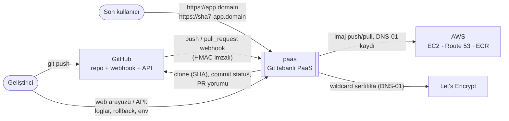
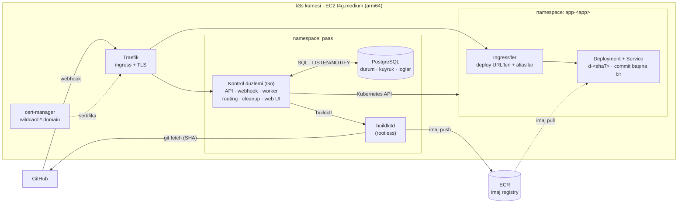
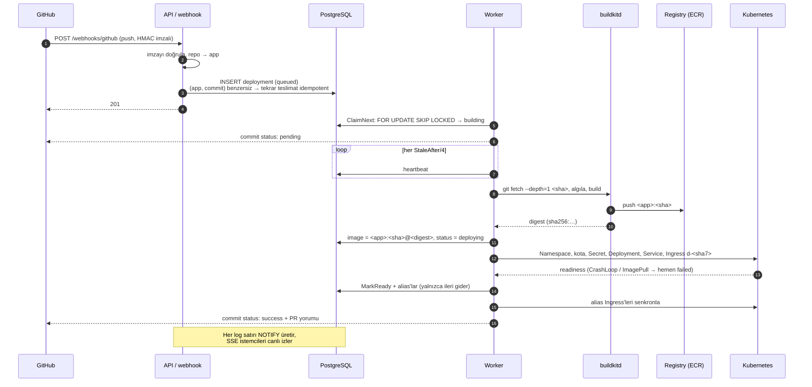
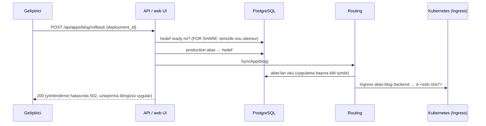
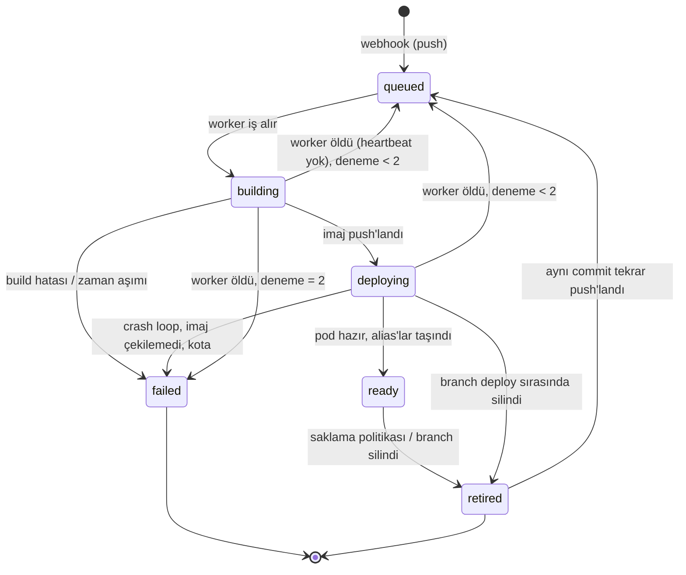
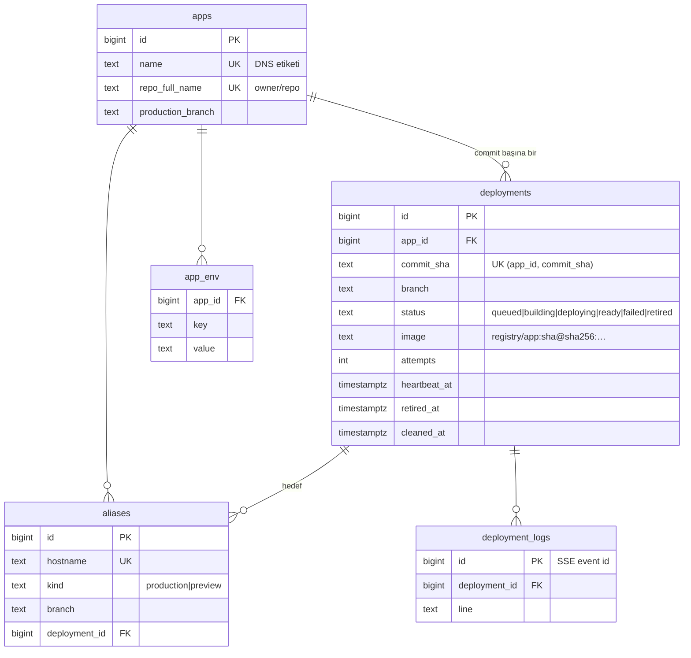

# Mimari

paas, her `git push`'u değişmez bir **deployment**'a çeviren, Git tabanlı bir PaaS'tır.
Bu belge sistemi dışarıdan içeriye doğru anlatır: bağlam, konteynerler, iki temel akış
(deploy ve rollback), durum makinesi ve veri modeli.

## 1. Bağlam

Sistemin dünyayla ilişkisi: geliştirici koda push eder, son kullanıcı uygulamayı açar,
platform GitHub ve AWS ile konuşur.

## 2. Konteynerler

Tek bir EC2 (ARM, k3s) üzerinde çalışan parçalar. Kontrol düzlemi tek bir Go ikilisidir;
API, webhook alıcısı, worker'lar, yönlendirme senkronu ve temizlik döngüsü aynı süreçtedir.

| Bileşen | Sorumluluk | Kod |
|---|---|---|
| API + webhook | REST API, imzalı GitHub webhook'u, SSE log akışı | `internal/api`, `internal/webhook` |
| Web arayüzü | Oturum, uygulama/deploy sayfaları, rollback, env | `internal/web`, `internal/auth` |
| Kuyruk + worker | `FOR UPDATE SKIP LOCKED` ile iş alma, heartbeat, aşamalar | `internal/store`, `internal/worker` |
| Build | SHA ile clone, dil algılama, Dockerfile üretimi, BuildKit | `internal/build` |
| Deploy | Namespace, kota, Secret, Deployment, Service, Ingress, hazır olma bekleme | `internal/deploy` |
| Yönlendirme | Alias'ları veritabanından Ingress'lere senkronlama, uzlaştırma | `internal/routing` |
| Temizlik | Saklama politikası, emekliye ayırma, nesne silme | `internal/cleanup` |
| GitHub | Commit status, PR "Preview hazır" yorumu | `internal/github` |
| Altyapı | VPC, EC2, EIP, Route 53, ECR, IAM, cloud-init | `infra/terraform`, `infra/k8s` |

## 3. Akış: push → deploy

## 4. Akış: rollback

Rollback yeni bir build ya da pod yeniden başlatması değildir: yalnızca production
alias'ının işaret ettiği deployment değişir.

Ölçülen API gecikmesi (veritabanı + senkron, dry-run): p50 7 ms, p95 23 ms
([MEASUREMENTS.md](MEASUREMENTS.md)).

## 5. Deployment durum makinesi

## 6. Veri modeli

## 7. Adlandırma

Tüm host'lar tek etiketli ve `*.domain` altındadır; tek bir wildcard sertifika hepsini kapsar.

| Ne | Host | Kubernetes adı |
|---|---|---|
| Deployment (değişmez) | `<sha7>-<app>.<domain>` | `app-<app>/d-<sha7>` |
| Production alias | `<app>.<domain>` | `app-<app>/alias-<app>` |
| Preview alias | `<branch>-<app>.<domain>` | `app-<app>/alias-<branch>-<app>` |
| Kontrol düzlemi | `<domain>` | `paas/paas` |
