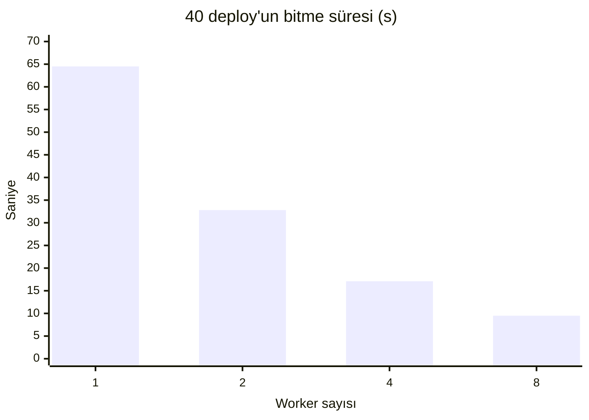

# Ölçümler

Tüm sayılar bu repodaki script'lerle üretildi ve yeniden üretilebilir. Ham sonuçlar
[`docs/measurements/`](measurements/) altında.

**Ortam:** Windows 11 dizüstü (x86-64), Docker Desktop 28.5, PostgreSQL 16 (Docker), Go 1.26, k6.
Bunlar yerel ölçümlerdir; hedef sunucuda (EC2 t4g.medium, arm64) tekrar alınmaları gerekir
(bkz. [Sınırlar](#sınırlar)).

## 1. Kuyruk ölçeklenmesi: worker sayısı

40 push aynı anda gelir (40 eşzamanlı istemci); her deploy dry-run pipeline ile ~1.5 s sürer
(3 × 500 ms taklit aşama). Ölçülen: webhook'un kabul süresi, push'tan `ready`'ye geçen süre ve
40 deploy'un tamamının bitme süresi.

```bash
scripts/measure-workers.sh 40 1 2 4 8
```

| Worker | Toplam süre | Hızlanma | Push → ready (medyan) | Push → ready (p95) | Webhook kabul (p95) | Başarısız |
|---:|---:|---:|---:|---:|---:|---:|
| 1 | 64.5 s | 1.0× | 32.8 s | 60.9 s | 229 ms | 0 / 40 |
| 2 | 32.8 s | 2.0× | 17.0 s | 30.6 s | 157 ms | 0 / 40 |
| 4 | 17.1 s | 3.8× | 9.3 s | 16.4 s | 112 ms | 0 / 40 |
| 8 | 9.5 s | 6.8× | 5.3 s | 8.6 s | 184 ms | 0 / 40 |



**Yorum:**
- Postgres kuyruğu (`FOR UPDATE SKIP LOCKED`) 8 worker'a kadar neredeyse doğrusal ölçekleniyor;
  160 deploy'un hiçbiri iki kez alınmadı ya da kaybolmadı (bu ayrıca
  `TestClaimNextIsExclusive` ile 8 worker × 50 işte doğrulanıyor).
- Webhook kabul süresi worker sayısından bağımsız olarak 250 ms'nin altında kalıyor: GitHub'ın
  10 saniyelik webhook zaman aşımının çok altında. Medyanın (~90 ms) 10 istemcili koşudaki
  ~6 ms'ye göre yüksek olması, aynı anda 40 istemcinin durumu her 500 ms'de sorgulamasından.
- Gerçek ortamda darboğaz worker değil build'dir: 2 vCPU'lu bir düğümde aynı anda 2–3 build'den
  fazlası birbirini yavaşlatır. `PAAS_WORKERS` bu yüzden varsayılan olarak 2.

## 2. Build süresi ve imaj boyutu

Platformun ürettiği Dockerfile ile, `examples/` altındaki üç uygulama. **Soğuk:** katman cache'i
yok. **Ilık:** hiçbir şey değişmedi. **Kod değişikliği:** bir kaynak dosya değişti, bağımlılık
katmanları cache'te.

```bash
scripts/measure-builds.sh
```

| Uygulama | Algılanan tip | Soğuk | Ilık | Kod değişikliği | İmaj |
|---|---|---:|---:|---:|---:|
| `node-hello` | Node, `start` script'i | 8.1 s | 2.6 s | 2.6 s | 61 MB |
| `go-hello` | Go, distroless | 19.4 s | 2.3 s | 4.3 s | 3 MB |
| `static-site` | nginx-unprivileged | 3.2 s | 2.2 s | 2.3 s | 20 MB |

**Yorum:**
- Cache mount'lar (`/root/.npm`, `/go/pkg/mod`, `/root/.cache/go-build`) sayesinde Go'da kod
  değişikliği sonrası build, soğuk build'in %22'si kadar sürüyor.
- Ilık build'lerin ~2.2 s'lik tabanı büyük ölçüde sabit maliyettir: üretilen Dockerfile'lardaki
  `# syntax=docker/dockerfile:1` satırı her build'de frontend imajını registry'de sorgular.
  Frontend'i sabit bir digest'e bağlamak bu süreyi kısaltabilir (sonraki iş).
- Go imajı, distroless + statik ikili sayesinde 3 MB (Docker'ın raporladığı boyut).
  Küçük imaj, yeni bir düğümde ilk çekme süresini doğrudan kısaltır.
- Uçtan uca bir push → `ready` örneği (Docker builder, dry-run deploy, `node-hello`):
  clone 0.7 s, build + push 3.8 s, toplam 5.3 s.

## 3. Rollback gecikmesi

Production iki hazır deploy arasında 100 kez gidip gelir; API çağrısının toplam süresi ölçülür.

```bash
scripts/measure-rollback.sh 100
```

| n | p50 | p95 | max |
|---:|---:|---:|---:|
| 100 | 7.1 ms | 23.1 ms | 33.4 ms |

Bu, kontrol düzleminin payıdır (veritabanı işlemi + alias senkronu). Kubernetes'te buna
yalnızca tek bir Ingress'in güncellenmesi eklenir: yeniden build yok, pod yeniden başlamıyor,
çünkü eski deploy zaten çalışıyor. Rollback sırasında kesinti olmadığı
`loadtest/app-traffic.js` ile gerçek kümede doğrulanmalıdır (bkz. [DEMO.md](DEMO.md)).

## 4. Gerçek küme (k3d, yerel)

k3s v1.35 (k3d), Traefik, NetworkPolicy etkin; kontrol düzlemi `PAAS_BUILDER=docker`,
`PAAS_DEPLOYER=kubernetes` ile. Kurulum: `scripts/k3d-up.sh`.

| Senaryo | Sonuç |
|---|---|
| İlk deploy (cache yok), push → `ready` | 20.4 s |
| Kod değişikliği, push → `ready` | 8.9 s (clone 0.6 s, build + push 3.3 s, rollout 4 s) |
| Üç adres Traefik üzerinden (`<sha7>-blog`, `blog`, `main-blog`) | hepsi 200 |
| Rollback API'si (Ingress güncellemesi dahil) | 66–68 ms |
| **Rollback sırasında trafik** (50 istek/s, 20 s) | **1 000 istek, 0 hata**, p50 2.4 ms, p95 4.6 ms |
| Bozuk commit (Node sözdizimi hatası) | build dahil 12.4 s'de `failed`, production etkilenmedi |
| Başarısız deploy'un nesneleri | temizlik döngüsü sildi; Ingress sahiplik ilişkisiyle birlikte gitti |
| Branch silme webhook'u | preview alias'ı kalktı (404), deploy `retired`, nesneleri silindi |
| Pod logları (`runtime-logs`) | çalışıyor |

Bu koşu iki hata buldu ve düzeltildi: crash mesajı yalnızca stack trace'in sonunu gösteriyordu
(artık hatayı adlandıran satır başta), TLS kapalıyken adresler `https://` olarak yazılıyordu.

## 5. Test kapsamı

| | |
|---|---|
| Go kaynak kodu | ~6 600 satır (testler hariç) |
| Test kodu | ~3 750 satır, 79 test fonksiyonu |
| Veritabanı testleri | gerçek PostgreSQL'e karşı (`make test`) |
| Kubernetes testleri | client-go fake clientset |
| Gerçek build testleri | `make test-build`: üç örnek gerçekten build edilir, çalıştırılır, HTTP yanıtı kontrol edilir |

## Sınırlar

- Ölçümler dizüstü bilgisayarda alındı; hedef EC2 (arm64, 2 vCPU, 4 GiB) üzerinde build süreleri
  farklı olacaktır.
- Kuyruk ölçeklenmesi dry-run pipeline ile ölçüldü: kontrol düzleminin kendisini ölçer, gerçek
  build/deploy maliyetini değil.
- Gerçek küme ölçümleri yerel k3d üzerinde alındı (bölüm 4); hedef sunucuda (arm64, TLS,
  ECR) tekrar alınmalı. Uygulama trafiğinin üst sınırı (istek/saniye) henüz ölçülmedi.
